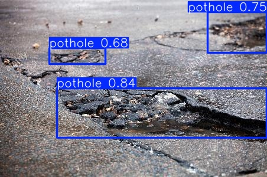

# Pothole Detection

Object detection model that identifies potholes from images using YOLOv8.

## Dataset

Dataset from [Brad Dwyer on Roboflow](https://universe.roboflow.com/brad-dwyer/pothole-voxrl)

## Model

- Architecture: YOLOv8n
- Epochs: 50
- Image size: 640x640

## Results

| Metric | Score |
|--------|-------|
| mAP50 | 0.773 |
| mAP50-95 | 0.506 |
| Precision | 0.786 |
| Recall | 0.667 |


## Sample Predictions



## Setup

1. Clone the repo
2. Create conda environment:

```python
    conda env create -f environment.yml
    conda activate pothole-detection
```

3. Download dataset from Roboflow and place in `data/` folder

## Usage

```python
from ultralytics import YOLO

model = YOLO('models/best.pt')
results = model.predict(source='path/to/image.jpg', conf=0.5)
results[0].show()
```
